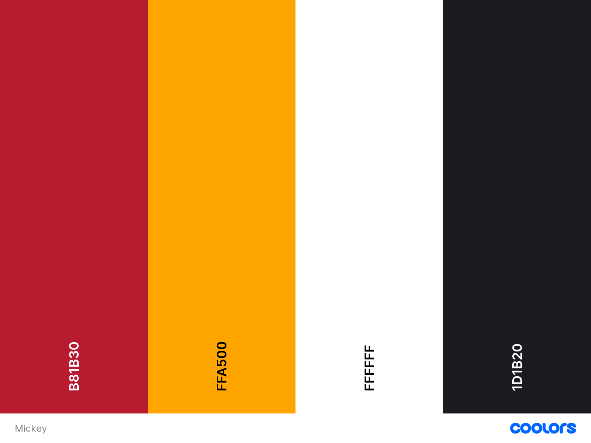

# Rock, Paper, Scissors, Lizard and Spock

The game design was inspired by mickey and his classic colors.

[View the live project here.](https://kroutm.github.io/RockPaperScissorsLizardSpock/)

## User Experience (UX)

-   ### User stories

    1. As a User, I want to immediately understand the intent of the site.
    2. As a User, I want to have play options.
    3. As a User, I want to view and navigate the website on all devices.
    4. As a User, I want to restart the game in a simple way.
    5. As a User, I want to see movement and interaction with the elements.
    6. As a User, I want to be able to choose another game option whenever I want.
    7. As a User, I want to feel stability and constancy in the changes.
    8. As a User, I want to see a scoreboard marking the points of the plays.
    9. As a User, I want to be informed that you won the match.

## Technologies used

### Languages Used

- [HTML5](https://en.wikipedia.org/wiki/HTML5)

- [CSS3](https://en.wikipedia.org/wiki/CSS)

- [javaScript](https://en.wikipedia.org/wiki/JavaScript)

### Frameworks Libraries and Programs

1. [Google Fonts](https://fonts.google.com/)
    - Google fonts were used to import the 'Bowlby One SC' and 'Orbitron' fonts into the index.css file which is used on all pages throughout the project.
1. [Font Awesome](https://fontawesome.com/)
    - I used the icons for decoration and game pick options (the hands rock, paper, scissors, lizard and spock).
1. [Github](https://github.com/)
    - Github was used to create and store the project repository.
1. [Visual Studio Code](https://code.visualstudio.com/)
    - Visual Studio Code was used to create my files and code the project.
1. [Am I responsive](http://ami.responsivedesign.is/)
    - Am I responsive was used to taking screenshots of the page at different screen sizes.
1. [BlueTree](https://bluetree.ai/screenfly/)
    - I used BlueTree to test the responsiveness and functionality of my website.
1. [Coolors](https://coolors.co/)
    - To get the website colors.
1. [Krita](https://krita.org/en/)
    - To draw Mickey's hands

-   ### Design
    -   #### Colour Scheme
        -   The colors used on this website were:
        

    -   #### Typography Bebas Neue
        -   Bowlby One SC was used for the titles and Orbitron was used for the "You Win and You Lose".

    -   #### Imagery
        -   Mickey's two hands were drawn in Krita by myself.

## Features
- The website is responsive on all device sizes.

    ### Index Page
    

    - ### Choose the number of maches
        

        - There are only three options: "Two out of three", "Three out of five" and "To infinity... and beyond!"
        - The first two are easy to understand, the first option is three plays on total and the second is five, but the third is "infinite" plays, in JavaScript code the limit is 9999, I left this option just for fun and testing.

    ### Game Page
    - The layout is simple but with the intention of being objective.

    

    - ### Link Home
        

        - To return to index page and the user can choose another option (number of maches).
        - Before it was written as "Home", but I decided to remove the word and change to an icon, because I wanted it to take up less space on the screen, leaving it like this the cleanest look.

    - ### Link Restart
        

        - As well as the "Home" button, the "Reset" button has also been replaced to an icon.
        - The "Restart" button refreshes the <>Game.html page.

    - ### Score Board
        

        - The Score Board is just an attempt to mimic the shape of Mickey's head.
        - On the left ear is written "User" which should indicate to the user that the left side of the game (Dots on the Board and Mickey's Hands on the left side) belongs to the user and the right side belongs to the PC.

    - ### Hands
        

        - The hands I draw on Krita. I couldn't find images of hands in the formats I wanted with a transparent background to use on the site.

    - ### Make your choice:
        

        - This sentence changes after the movements are made, through JavaScript code, the sentence shows if the user won or lost to the computer.
        - The phrase is kind of boring, it informs the player in a tedious way, I would like I had thought of a better way to show it to the user. I imagine the player wouldn't find it fun to read phrases like these hahaha. The sentence changes whenever the result is different from the previous one.

    - ### You Lose You Win
        

        - It's just a sentence that appears at the end of the game saying if the user won or lost adding up the total points of each one.

## Testing
The W3C Markup Validator and W3C CSS Validator Services were used to validate every page of the project to ensure there were no syntax errors in the project.

- [Markup Validation Service](https://validator.w3.org/)
- [CSS Validation Service](https://jigsaw.w3.org/css-validator/)

## BUGS AND SETTINGS

1. The first bug as I mentioned above, is the infinite points option, I hope you understand that I could have written a more rational option, but I didn't think it was necessary and decided to keep it. It was easier to test my codes with this option available.

2. The second problem which is not necessarily a bug or bug, but something that could be improved, is the phrase "Make your choice:", I would like to add something that the user doesn't need to read.

3. If the user presses the button (Font Awesome icons) many times and too fast consecutively, the points or the hand animation would not work as they should, some points will not be added for not having had "time enough", then the user will not know why the PC or the user himself earned points, the code waits for all the animation to be done to show the points and I didn't write anyway to prevent the user from pressing the button like that.

4. Although there is a phrase that informs if the user won or the PC, the phrase only appears if the user clicks on the icons again. I tried changing function's local to put +1 on else but none of these options and others worked as the problem is in platMatch(), the function tests the if first and so you need to press the icon again because the else will be true, but I couldn't think of another way to write all the code again. Despite the problem, I chose to have this function.

## Credits

[Code](https://github.com/developedbyed/rock-paper-scissor)
+ I took inspiration from this developer's code.